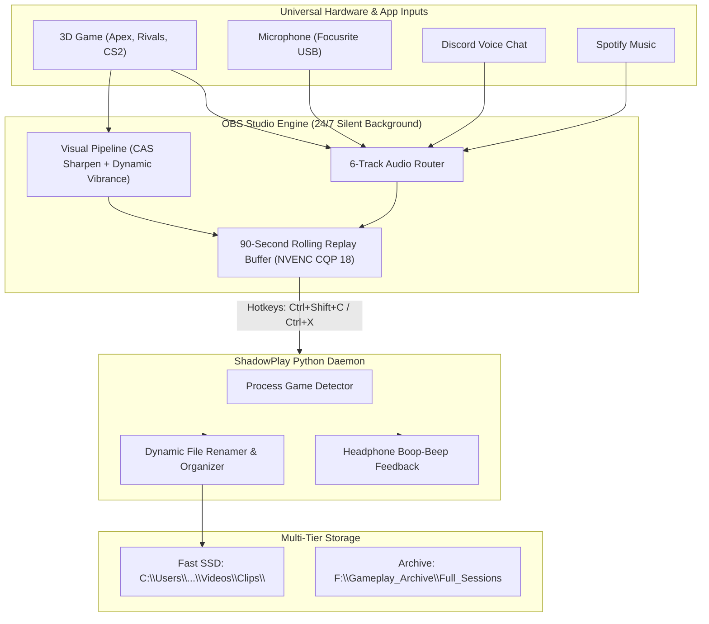

# ShadowPlay-Pro-OBS ⚡
### Enterprise-Grade 24/7 Silent Game Capture, Multi-Layer Audio Isolation & Dynamic Replay Engine

> **A high-performance, GUI-less NVIDIA ShadowPlay replacement built on OBS Studio 32+ and Python. Engineered for competitive gamers, streamers, and montage editors.**

---

## 🚀 Key Features

* **⚡ Pure 24/7 GUI-less Operation:** Runs silently in the background and docked to the System Tray. Starts on Windows boot with zero windows or popups.
* **🎮 Game-Aware Dynamic Replay Engine:** Automatically detects the active 3D game (Apex Legends, Marvel Rivals, CS2, Valorant, etc.) and routes clips into categorized folders with clean timestamps:
  ```text
  Videos/Clips/
  ├── Apex Legends/
  │   └── Apex_Legends_2026-09-29_18-19-10.mp4
  ├── Marvel Rivals/
  │   └── Marvel_Rivals_2026-09-29_19-02-15.mp4
  └── clips_index.jsonl
  ```
* **🎨 "On Crack" Visual Processing Pipeline:**
  * **Dynamic Edge Contrast (0.10 Sharpening):** Removes TAA and motion blur softness without halo ringing.
  * **Vibrance & Color Pop (1.20 Saturation):** Deepens character models, shields, abilities, and particle effects.
  * **Contrast & Gamma Curve (0.06 Contrast, -0.04 Gamma):** Delivers rich blacks and HDR-like highlight pop without crushing shadow detail.
* **🎙️ Universal Multi-Layer Audio Isolation (5 Dedicated Tracks):**
  * **Track 1:** Master Mix (Game + Mic + Discord Homies) — Ready for immediate sharing.
  * **Track 2:** Pure Game Audio Alone (Clean game sound, zero voice, zero music) — Pure montage editing bliss.
  * **Track 3:** Isolated Microphone (Your voice alone).
  * **Track 4:** Isolated Discord Voice Chat (Homies' banter isolated for funny moment subtitles or muting).
  * **Track 5:** Isolated Music (Spotify alone, never leaked into clips).
  * **Track 6:** Live Stream Broadcast Mix (Twitch / Kick broadcast output).
* **💾 Multi-Drive Storage Tiering:**
  * **Fast Tier (NVMe SSD):** 90-Second Rolling Replay Buffer in RAM (3072 MB) writing instant highlights to SSD.
  * **Archive Tier (Secondary HDD/NVMe):** Multi-hour full-session recordings write directly to bulk archive storage (`F:\Gameplay_Archive`).
* **🔔 Audible In-Headset Confirmation:** Ascending double-tone confirmation chime (`1200Hz` → `1800Hz`) played directly through your headphones the millisecond a clip lands on disk.
* **⌨️ 65% Keyboard & Left-Hand Ergonomics:** Native keybind chords designed for left-hand reach during intense combat (`Ctrl + Shift + C` or `Ctrl + X`), bypassing missing function rows and remapped Alt keys.

---

## 🏗️ Architecture



---

## 📦 Quick Installation

### Prerequisites
* **Windows 10 / 11 64-bit**
* **NVIDIA GeForce RTX GPU** (NVENC hardware encoder)
* **OBS Studio 32+**
* **Python 3.10+** (with `psutil` installed)

### 1-Click Setup
1. Clone or download this repository to your machine.
2. Open PowerShell as Administrator and run:
   ```powershell
   Set-ExecutionPolicy Bypass -Scope Process -Force
   .\install.ps1
   ```
3. That's it! OBS and the ShadowPlay Engine will register as 24/7 background tasks and start immediately.

---

## 🎛️ Default Keybinds (65% Keyboard Layout)

| Hotkey | Action | Description |
| :--- | :--- | :--- |
| **`Ctrl + Shift + C`** | **Save 90s Clip** | Standard left-hand thumb + index reach. |
| **`Ctrl + X`** | **Save 90s Clip** | Fast two-finger chord during intense gunfights. |
| **`Ctrl + Shift + X`** | **Save 90s Clip** | Alternative ergonomic reach. |
| **`Ctrl + Shift + S`** | **Save 90s Clip** | Muscle memory alternative. |

---

## 📁 File Structure

```text
ShadowPlay-Pro-OBS/
├── README.md                  # Comprehensive Documentation
├── install.ps1                # 1-Click Turnkey PowerShell Installer
├── config/
│   ├── basic.ini              # Tuned OBS Profile (CQP 18, 5 audio tracks, 90s buffer)
│   └── game_signatures.json   # Known game process database
├── daemon/
│   ├── shadowplay_engine.py   # Game detection, clip renamer & audio feedback daemon
│   └── game_signatures.json   # Process mappings
└── scripts/
    ├── start_shadowplay.ps1   # Start all 24/7 background tasks
    └── stop_shadowplay.ps1    # Gracefully stop all background tasks
```

---

## 🎮 Supported Game Signatures Out of the Box

* **Apex Legends** (`r5apex_dx12.exe`, `r5apex.exe`)
* **Marvel Rivals** (`MarvelRivals.exe`, `Marvel-Win64-Shipping.exe`)
* **Marvel's Spider-Man 2** (`Spider-Man2.exe`)
* **Counter-Strike 2** (`cs2.exe`)
* **Valorant** (`VALORANT-Win64-Shipping.exe`)
* **Overwatch 2** (`Overwatch.exe`)
* **Fortnite** (`FortniteClient-Win64-Shipping.exe`)
* **Call of Duty** (`cod.exe`, `ModernWarfare.exe`)
* **Deadlock** (`Deadlock.exe`)
* **Rocket League** (`RocketLeague.exe`)
* **Cyberpunk 2077** (`Cyberpunk2077.exe`)
* **Elden Ring** (`EldenRing.exe`)
* *...and any custom game can be added in 1 line in `game_signatures.json`!*

---

## 📄 License
MIT License. Free for all competitive gamers, editors, and creators.
