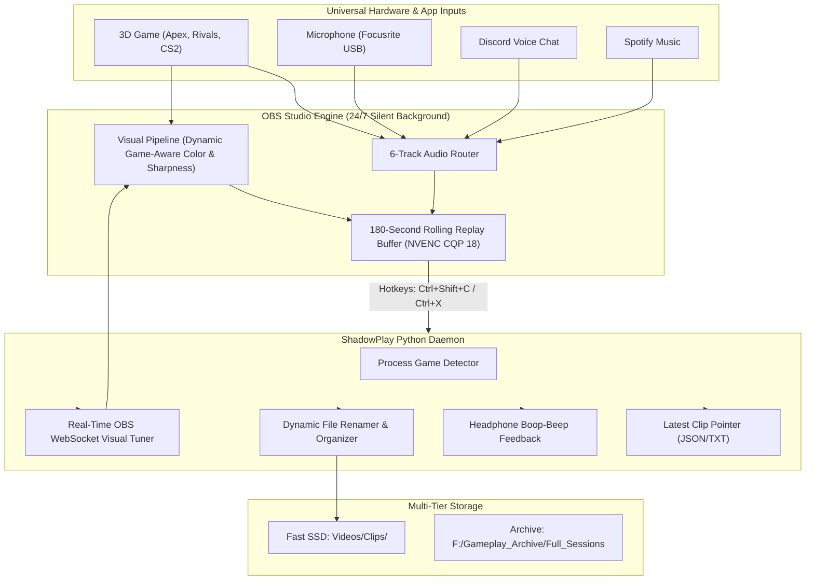

# obs-replaybuffertool ⚡
### Enterprise-Grade 24/7 Silent Game Capture, Multi-Layer Audio Isolation & Dynamic Replay Engine
**Repository:** [https://github.com/solufelo/obs-replaybuffertool](https://github.com/solufelo/obs-replaybuffertool)

> **A high-performance, GUI-less NVIDIA ShadowPlay replacement built on OBS Studio 30+ and Python. Engineered for competitive gamers, streamers, and montage editors.**

---

## 🚀 Key Features

* **⚡ Pure 24/7 GUI-less Operation:** Runs silently in the background minimized to the System Tray. Starts on Windows boot with zero UI popups, zero screen clutter, and `--disable-shutdown-check` safe mode bypassing.
* **🎮 Game-Aware Dynamic Replay Engine:** Automatically detects the active 3D game process (Apex Legends, Marvel Rivals, CS2, Valorant, etc.) and routes clips into categorized folders with clean timestamps:
  ```text
  Videos/Clips/
  ├── Apex Legends/
  │   └── Apex_Legends_2026-09-29_18-19-10.mp4
  ├── Marvel Rivals/
  │   └── Marvel_Rivals_2026-09-29_19-02-15.mp4
  └── clips_index.jsonl
  ```
* **🎨 Autonomous Game-Aware Visual Tuning:**
  * **Apex Legends Profile:** Subtle esports contrast and edge clarity (`saturation: 1.10`, `sharpness: 0.04`).
  * **Marvel Rivals Profile:** Cinematic natural tone curve (`saturation: 1.03`, `sharpness: 0.00` to prevent DLSS 85 ringing).
  * **Universal Default:** Balanced studio clarity across any other title.
* **🎙️ Universal Multi-Layer Audio Isolation (5 Dedicated Tracks):**
  * **Track 1:** Master Mix (Game + Mic + Discord Homies) — Ready for immediate sharing.
  * **Track 2:** Pure Game Audio Alone (Clean game sound, zero voice, zero music) — Pure montage editing bliss.
  * **Track 3:** Isolated Microphone (Your voice alone).
  * **Track 4:** Isolated Discord Voice Chat (Homies' banter isolated for funny moment subtitles or muting).
  * **Track 5:** Isolated Music (Spotify alone, never leaked into clips).
  * **Track 6:** Live Stream Broadcast Mix (Twitch / Kick broadcast output).
* **💾 Multi-Drive Storage Tiering:**
  * **Fast Tier (NVMe SSD):** 180-Second (3 Full Minutes) Rolling Replay Buffer in RAM (6,144 MB Cache) writing instant highlights to SSD.
  * **Archive Tier (Secondary HDD/NVMe):** Multi-hour full-session recordings write directly to bulk archive storage (`F:\Gameplay_Archive`).
* **🔔 Audible In-Headset Confirmation:** Ascending double-tone confirmation chime (`1200Hz` → `1800Hz`) played directly through your headphones the millisecond a clip lands on disk.
* **⌨️ Octane Speed Demon Movement & Ability Input Overlay:**
  * **Zero Input Lag:** Microsecond Win32 polling at 120Hz for 1000Hz - 8000Hz gaming mice and rapid triggers.
  * **Custom Octane Aesthetics:** Dynamic glowing acid-green Stim Syringe (`#00FF66`) triggered by `Left Alt` (remapped to `P`), `P`, or `Q`; Octane Jump Pad launch indicator on `Space`; weapon holster icon on `Mouse 4` / `1` / `2` / `3`.
  * **Movement Visualizer:** High-contrast keys (`W`, `A`, `S`, `D`, `INTERACT`, `CROUCH`) with active scroll-wheel directional pulse counters (`▲` for Tap-Strafe, `▼` for Bunny Hop) and live mouse button triggers.
  * **In-Engine OBS Integration:** Hardware-accelerated Browser Source with true 32-bit RGBA transparency anchored seamlessly below the webcam.
* **📊 Twitch Apex Stats (TAS) Live Ranked Integration:**
  * **Real-Time Ranked HUD:** Live Platinum II / Predator rank badge, current RP (`10,215`), session RP change (`+/-`), match history, and progression bar to next rank (`Diamond IV`).
  * **Optimized Stream Geometry:** Positioned at `(25, 270)` directly below the mini-map, leaving the entire combat viewport, crosshair, and teammate banners 100% unobstructed.
* **🎥 4-Scene Broadcast Production Suite:**
  * **1. GAMEPLAY ULTRA (Active):** High-refresh game capture, widescreen cropped webcam with neon-green Octane frame (`webcam_frame.html`), Octane Speed Demon input overlay, rotating social ticker (`social_ticker.html`), and live TAS ranked RP badge.
  * **2. JUST CHATTING / FULL CAM (Vibes):** Large cinematic camera with cyber-mesh frame, live chat card, TAS RP badge, creator bio, and rotating social pill ticker for engaging with chat between games.
  * **3. BE RIGHT BACK / INTERMISSION:** Ambient intermission screen with rank pill, socials, and background music.
  * **4. STREAM STARTING SOON:** Pulsing neon broadcast countdown, audio waves, and socials.
* **🛡️ Silent Boot & Zero Twitch Error Popups:** Purged broken OAuth dock tokens while preserving direct high-bitrate RTMP stream keys for Twitch, Kick, and YouTube. OBS boots into tray completely silently with zero error dialogs.

---

## 🏗️ Architecture



---

## 📦 Quick Installation

### Prerequisites
* **Windows 10 / 11 64-bit**
* **NVIDIA GeForce RTX GPU** (NVENC hardware encoder)
* **OBS Studio 30+**
* **Python 3.10+** (with `psutil` installed)

### 1-Click Setup
1. Clone or download this repository:
   ```bash
   git clone https://github.com/solufelo/obs-replaybuffertool.git
   cd obs-replaybuffertool
   ```
2. Open PowerShell as Administrator and run:
   ```powershell
   Set-ExecutionPolicy Bypass -Scope Process -Force
   .\install.ps1
   ```
3. That's it! OBS and the ShadowPlay Engine will register as 24/7 background tasks and start immediately.

---

## 🎛️ Default Keybinds & Stream Hotkeys

| Hotkey | Action | Description |
| :--- | :--- | :--- |
| **`Ctrl + Shift + C`** | **Save 3-Min Clip** | Standard left-hand thumb + index reach. |
| **`Ctrl + X`** | **Save 3-Min Clip** | Fast two-finger chord during intense gunfights. |
| **`Ctrl + Shift + X`** | **Save 3-Min Clip** | Alternative ergonomic reach. |
| **`Ctrl + Shift + S`** | **Save 3-Min Clip** | Muscle memory alternative. |
| **`Ctrl + F1` / `F6`** | **Gameplay Ultra** | Switch to main gaming scene with HUD & input overlay. |
| **`Ctrl + F2` / `F7`** | **Just Chatting** | Switch to full-cam cinematic engagement scene. |
| **`Ctrl + F3` / `F8`** | **Be Right Back** | Switch to ambient break/intermission screen. |
| **`Ctrl + F4` / `F5`** | **Starting Soon** | Switch to stream starting countdown screen. |

---

## 📁 File Structure

```text
obs-replaybuffertool/
├── README.md                  # Comprehensive Documentation
├── install.ps1                # 1-Click Turnkey PowerShell Installer
├── config/
│   ├── basic.ini              # Tuned OBS Profile (CQP 18, 5 audio tracks, 180s buffer)
│   ├── recordEncoder.json     # Low-latency NVENC encoder preset
│   └── scene_collection.json  # 4 Pre-routed broadcast scenes, audio isolation & overlays
├── daemon/
│   ├── shadowplay_engine.py   # Game detection, clip renamer, visual tuner & audio cue
│   ├── input_overlay_daemon.py# Low-latency Win32 input hook & WebSocket broadcast server
│   └── game_signatures.json   # Known process mappings
├── overlay/
│   ├── index.html             # Octane Speed Demon movement & ability input overlay
│   ├── webcam_frame.html      # Octane neon-green camera frame with LIVE badge
│   ├── social_ticker.html     # Dynamic rotating creator social marquee ticker
│   ├── just_chatting_frame.html# Just Chatting broadcast layout with SVG cam cutout
│   ├── starting_soon.html     # High-production animated starting soon screen
│   └── brb_screen.html        # High-production animated intermission screen
├── tools/
│   └── NohBoard/              # Standalone NohBoard-ReWrite with MokeyApex layout
└── scripts/
    ├── start_shadowplay.ps1   # Start all 24/7 background tasks
```

---

## 🎮 Supported Game Signatures Out of the Box

* **Apex Legends** (`r5apex_dx12.exe`, `r5apex.exe`)
* **Marvel Rivals** (`MarvelRivals.exe`, `Marvel-Win64-Shipping.exe`, `Marvel.exe`)
* **Marvel's Spider-Man 2** (`Spider-Man2.exe`)
* **Counter-Strike 2** (`cs2.exe`)
* **Valorant** (`VALORANT-Win64-Shipping.exe`)
* **Overwatch 2** (`Overwatch.exe`)
* **Fortnite** (`FortniteClient-Win64-Shipping.exe`)
* **Call of Duty** (`cod.exe`, `ModernWarfare.exe`)
* **Deadlock** (`Deadlock.exe`)
* **Rocket League** (`RocketLeague.exe`)
* **Cyberpunk 2077** (`Cyberpunk2077.exe`)
* **Elden Ring** (`EldenRing.exe`)
* *...and any custom game can be added in 1 line in `game_signatures.json`!*

---

## 📄 License
MIT License. Free for all competitive gamers, editors, and creators.
